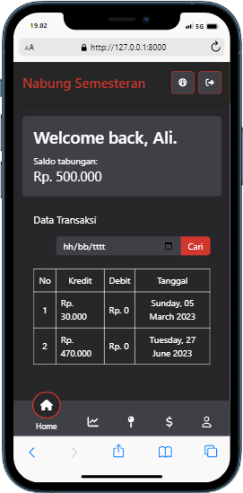
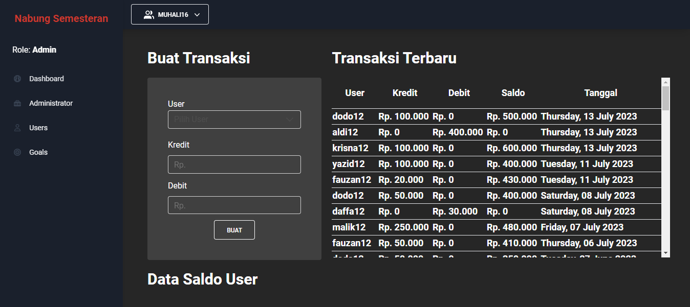

# Nabung Semesteran Web App

Website ini dibuat untuk merencanakan pengeluaran untuk aktivitas jalan-jalan libur semesteran yang diselenggarakan oleh teman-teman saya.

### Fitur
* Catatan pemasukan setiap user
* Catatan pengeluaran setiap user
* Akumulasi saldo tabungan
* Progress akumulasi saldo tabungan
* Melakukan login user
* Menambahkan user baru oleh admin
* Sistem level admin
* Autorisasi user
* Halaman dashboard administrator
* Menambahkan destinasi wisata beserta jadwalnya
* Catatan pengeluaran event (upcoming)

### Tampilan Wesite
1. Tampilan mobile

2. Tampilan dashboard
   

(*) Jika ingin membutuhkan full dokumentasi bisa langsung direct message ke [sini](https://muhali16.github.io)
